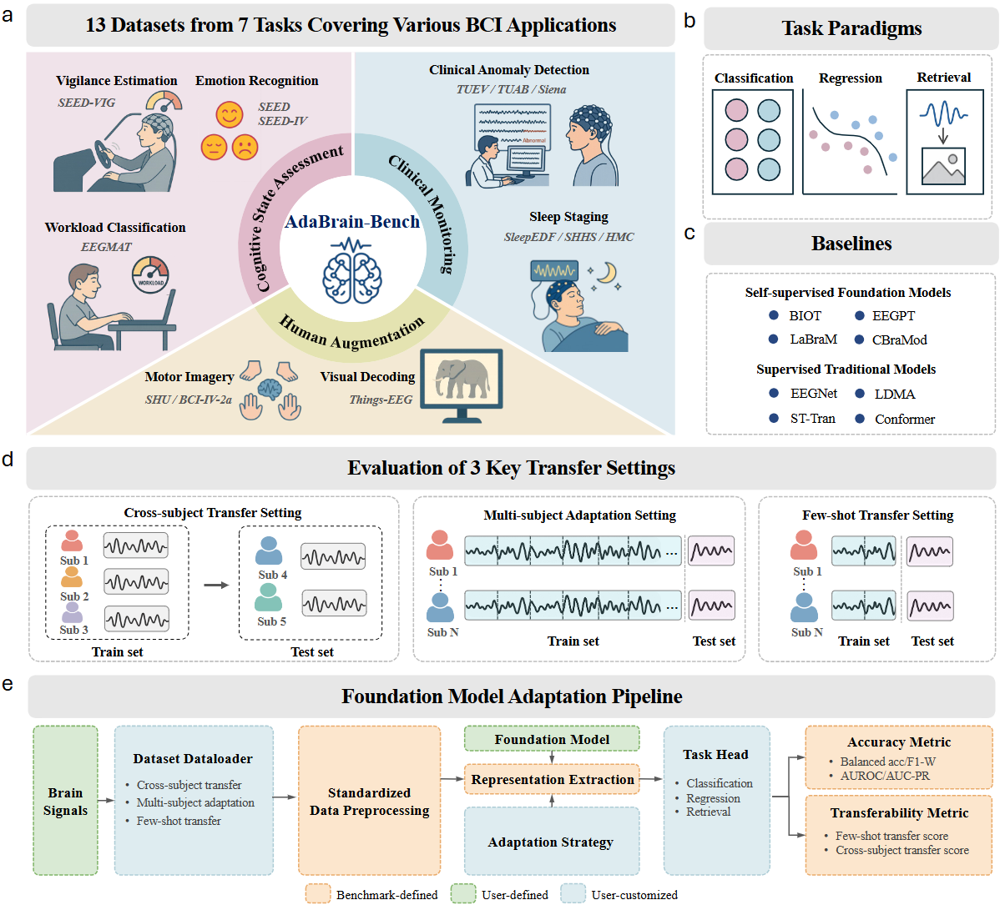

<div align="center">
  
# AdaBrain-Bench: Benchmarking Brain Foundation Models for Brain-Computer Interface Applications<br>

_Jiamin Wu, Zichen Ren, Junyu Wang, Pengyu Zhu, Yonghao Song, Mianxin Liu, Qihao Zheng, Lei Bai, Wanli Ouyang, Chunfeng Song_

<p>
    
</p>

[](https://arxiv.org/abs/2505.17099)


</div>
<br>


AdaBrain-Bench provides code for evaluating EEG foundation models across **13 datasets and 7 tasks**, covering **cognitive state assessment, human augmentation, and clinical monitoring**. It supports diverse task paradigms, including **classification, regression, and retrieval**, with comprehensive evaluation metrics. Additionally, it employs multifaceted evaluation settings including **cross-subject, multi-subject, and few-shot setting** to thoroughly assess models downstream task generalization ability in various scenarios.


## Contents
- [Leaderboard](#leaderboard-in-progress)
- [Installation](#installation)
- [Dataset preparation](#dataset-preparation)
- [Models](#models)
- [Runing](#running)


## Leaderboard (in progress)
### Cross-Subject Transfer
| Dataset       | Metrics | [EEGNet](https://github.com/amrzhd/EEGNet) | [LDMA](https://github.com/MiaoZhengQing/LMDA-Code)  | [ST-Tran](https://github.com/eeyhsong/EEG-Transformer) | [Conformer](https://github.com/eeyhsong/EEG-Conformer) | [BIOT](https://github.com/ycq091044/BIOT)  | [EEGPT](https://github.com/BINE022/EEGPT) | [LaBraM](https://github.com/935963004/LaBraM) | [CBraMod](https://github.com/wjq-learning/CBraMod) |
|:-------------:|:-------:|:------:|:-----:|:---------:|:---------:|:---------:|:-----:|:---------:|:---------:|
| **SEED**      | B-Acc   | 52.32  | 53.34 | 50.15     | 53.12     | 47.89     | 49.90 | **55.78** | 51.11     |
|               | F1-W    | 49.50  | 52.96 | 48.02     | 50.80     | 47.18     | 46.70 | **53.78** | 50.81     |
| **SEED-IV**   | B-Acc   | 34.85  | 36.32 | 32.94     | 34.94     | 35.06     | 31.20 | **40.98** | 39.36     |
|               | F1-W    | 28.72  | 35.45 | 33.20     | 33.20     | 33.52     | 29.94 | **40.61** | 38.70     |
| **EEGMAT**    | B-Acc   | 63.33  | 64.72 | 57.50     | 73.89     | 73.61     | 61.66 | 85.83     | **88.89** |
|               | AUROC   | 67.79  | 69.03 | 65.96     | 75.61     | 84.44     | 63.85 | 94.42     | **95.56** |
| **SEED-VIG**  | Corr    | 58.34  | 57.22 | 49.19     | 52.11     | 62.98     | 57.83 | **65.52** | 60.47     |
|               | R2      | 26.65  | 11.15 | 3.98      | 2.55      | **27.09** | 23.47 | 25.35     | 2.40      |
| **BCI-IV-2A** | B-Acc   | 47.83  | 36.20 | 31.42     | 44.88     | 42.53     | 25.81 | **54.98** | 47.71     |
|               | F1-W    | 45.46  | 32.55 | 26.84     | 41.54     | 39.70     | 18.52 | **54.90** | 46.25     |
| **SHU**       | B-Acc   | 56.48  | 56.39 | 51.66     | 52.96     | 49.99     | 55.23 | 58.88     | **59.21** |
|               | AUROC   | 61.06  | 60.17 | 53.31     | 56.76     | 49.87     | 58.34 | **62.74** | 62.02     |
| **Things-EEG**| 2-Way   | 82.58  | 80.93 | 84.40     | 69.92     | 57.90     | 77.30 | **84.50** | 83.20     |
|               | Top-5   | 18.67  | 19.36 | 24.85     | 10.25     | 4.65      | 19.70 | **26.05** | 23.15     |
| **TUEV**      | B-Acc   | 32.65  | 32.88 | 38.68     | 54.06     | 51.78     | 42.89 | **59.05** | 57.69     |
|               | F1-W    | 71.66  | 69.54 | 70.06     | 77.52     | 75.17     | 74.65 | **79.62** | 78.69     |
| **TUAB**      | B-Acc   | 77.58  | 78.37 | 81.04     | 78.92     | 78.07     | 80.54 | **81.50** | 80.05     |
|               | AUC-PR  | 86.48  | 86.97 | **90.41** | 87.95     | 86.93     | 89.36 | 90.08     | 89.19     |
| **Siena**     | B-Acc   | 72.29  | 66.37 | 64.37     | **72.87** | 71.67     | 59.54 | 66.03     | 65.12     |
|               | AUC-PR  | 33.26  | 41.39 | 31.97     | 41.23     | 49.13     | 28.30 | 42.29     | **51.53** |
| **HMC**       | B-Acc   | 66.67  | 70.33 | 73.73     | **73.84** | 70.63     | 70.21 | 71.94     | 71.40     |
|               | F1-W    | 67.63  | 76.15 | **77.52** | 77.30     | 74.52     | 74.22 | 74.28     | 72.24     |
| **SHHS**      | B-Acc   | 61.65  | 65.75 | 68.67     | 68.42     | 72.22     | 66.46 | 71.69     | **73.51** |
|               | F1-W    | 73.79  | 78.64 | 80.88     | 81.15     | 83.56     | 78.43 | 82.90     | **84.00** |
| **Sleep-EDF** | B-Acc   | 48.94  | 58.83 | **69.55** | 61.15     | 64.95     | 60.99 | 68.94     | 69.47     |
|               | F1-W    | 78.11  | 84.06 | 86.36     | 84.07     | 83.80     | 84.90 | 87.28     | **87.40** |
| **Macro-average**   | / | 56.32  | 56.73 | 55.64     | 58.12     | 58.42     | 55.00 | **64.61** | 62.66     |
### Multi-Subject Adaptation (Table 3)
| Dataset       | Metrics | [EEGNet](https://github.com/amrzhd/EEGNet) | [LDMA](https://github.com/MiaoZhengQing/LMDA-Code)  | [ST-Tran](https://github.com/eeyhsong/EEG-Transformer) | [Conformer](https://github.com/eeyhsong/EEG-Conformer) | [BIOT](https://github.com/ycq091044/BIOT)  | [EEGPT](https://github.com/BINE022/EEGPT) | [LaBraM](https://github.com/935963004/LaBraM) | [CBraMod](https://github.com/wjq-learning/CBraMod) |
|:-------------:|:-------:|:------:|:-----:|:-----:|:-----:|:-----:|:-----:|:---------:|:-----:|
| **SEED**      | B-Acc   | 52.72  | 58.13 | 55.59 | 57.42 | 58.37 | 57.50 | **70.90** | 70.31 |
|               | F1-W    | 53.38  | 58.71 | 55.08 | 57.61 | 58.74 | 58.15 | **71.37** | 70.69 |
| **SEED-IV**   | B-Acc   | 33.82  | 27.17 | 25.50 | 37.62 | 36.19 | 30.57 | **47.63** | 44.20 |
|               | F1-W    | 37.25  | 19.42 | 28.71 | 42.13 | 38.67 | 28.31 | **49.14** | 45.58 |
| **BCI-IV-2A** | B-Acc   | 56.30  | 39.12 | 32.10 | 52.39 | 50.67 | 54.01 | **60.75** | 59.03 |
|               | F1-W    | 56.30  | 38.84 | 28.01 | 52.39 | 50.57 | 53.86 | **60.71** | 59.07 |
| **SHU**       | B-Acc   | 62.17  | 62.94 | 61.41 | 61.31 | 59.16 | 62.87 | **67.90** | 66.47 |
|               | AUROC   | 69.15  | 70.18 | 67.25 | 68.42 | 63.28 | 68.11 | **74.58** | 73.16 |
| **Macro-average**   | / | 52.64  | 46.81 | 44.21 | 53.66 | 51.96 | 51.67 | **62.87** | 61.06 |
### Few-Shot Transfer

For additional results and analyses, including the impact of pre-training, number of training subjects, normalization effects, and other key findings, please refer to our full paper.

## Installation
Install required packages:
```bash
conda create -n AdaBrain-Bench python=3.10
conda activate AdaBrain-Bench
pip install -r requirements.txt
```


## Dataset Preparation

Please refer to [DATASETS.md](DATASETS.md) for dataset download and preprocessing. Before running the fine-tuning code, you need to create json files to record the dataset information for different task paradigms in `/dataset_config` folder, which is formatted as follows:
```Classification.json
{
  "BCI-IV-2A": {
    "root": {
      "multi": "./preprocessing/BCI-IV-2A/multi_subject_json",
      "cross": "./preprocessing/BCI-IV-2A/cross_subject_json",
      "fewshot": "./preprocessing/BCI-IV-2A/multi_subject_json"
    },
    "num_classes": 4,
    "num_t": 4
  },
  "SEED": {
    "root": {
      "multi": "./preprocessing/SEED/multi_subject_json",
      "cross": "./preprocessing/SEED/cross_subject_json",
      "fewshot": "./preprocessing/SEED/multi_subject_json"
    },
    "num_classes": 3,
    "num_t": 1
  }
}
```
Here, "root" represents the folder containing the JSON files of the dataset. "multi", "cross", and "fewshot" stands for various settings. "num_classes" indicates the number of classes for the task. "num_t" represents the duration of the dataset signals in seconds.

## Models

We provide the links of the pre-trained weights for the following models. You can download them using the links below and place them in the `/checkpoints` folder.

| Model Name | Weight & Link |
|------------|-------------------------------|
| EEGPT      | [eegpt_mcae_58chs_4s_large4E.ckpt](https://github.com/BINE022/EEGPT) |
| LaBraM     | [labram-base.pth](https://github.com/935963004/LaBraM/tree/main/checkpoints) |
| CBraMod    | [pretrained_weights.pth](https://huggingface.co/weighting666/CBraMod) |
| BIOT       | [EEG-six-datasets-18-channels.ckpt](https://github.com/ycq091044/BIOT/tree/main/pretrained-models) |

---

To integrate a new model, see [ADD_MODEL.md](ADD_MODEL.md) for step-by-step instructions.

## Running
### Run Classification
After preparing the JSON file, you only need to execute a single command in the command line, to run the Classification task.

Take LaBraM and EEGPT on BCI-IV-2A as examples.
```bash
python run_finetuning.py  --model_name LaBraM  --dataset BCI-IV-2A --task_mod Classification --subject_mod cross --finetune_mod full --norm_method z_score --batch_size 64 --epochs 50 --lr 1e-3  --sampling_rate 200 --seed 0
```

```bash
python run_finetuning.py --model_name EEGPT --dataset BCI-IV-2A --task_mod Classification --subject_mod cross --finetune_mod full --norm_method z_score --batch_size 64 --epochs 50 --lr 1e-3  --sampling_rate 250 --seed 0
```
### Run Regression
To run the Regression task, you only need to execute a single command in the command line. 

Take LaBraM and EEGPT on SEED-VIG as examples.
```bash
python run_finetuning.py --model_name LaBraM --dataset SEED-VIG --task_mod Regression --subject_mod cross --finetune_mod linear --norm_method z_score --batch_size 64 --epochs 50 --lr 1e-3 --sampling_rate 200 --seed 0
```
```bash
python run_finetuning.py --model_name EEGPT --dataset SEED-VIG --task_mod Regression --subject_mod cross --finetune_mod linear --norm_method z_score --batch_size 64 --epochs 50 --lr 1e-3 --sampling_rate 250 --seed 0
```

### Run Retrieval
To run the Retrieval task, you only need to execute a single command in the command line. 

Take LaBraM and EEGPT on Things-EEG as examples.
```bash
python run_finetuning.py --model_name CodeBrain --dataset Things-EEG --task_mod Retrieval --subject_mod cross --finetune_mod full --norm_method z_score --batch_size 512 --epochs 40 --lr 5e-4 --subject_id 1 --sampling_rate 200 --seed 42 --weight_decay 0.05 --num_workers 16 --logger
```
```bash
python run_finetuning.py --task_mod Retrieval --model_name EEGPT --finetune_mod full --dataset Things-EEG --norm_method z_score --epochs 40 --batch_size 512 --lr 5e-4 --subject_mod single --subject_id 8 --seed 0
```