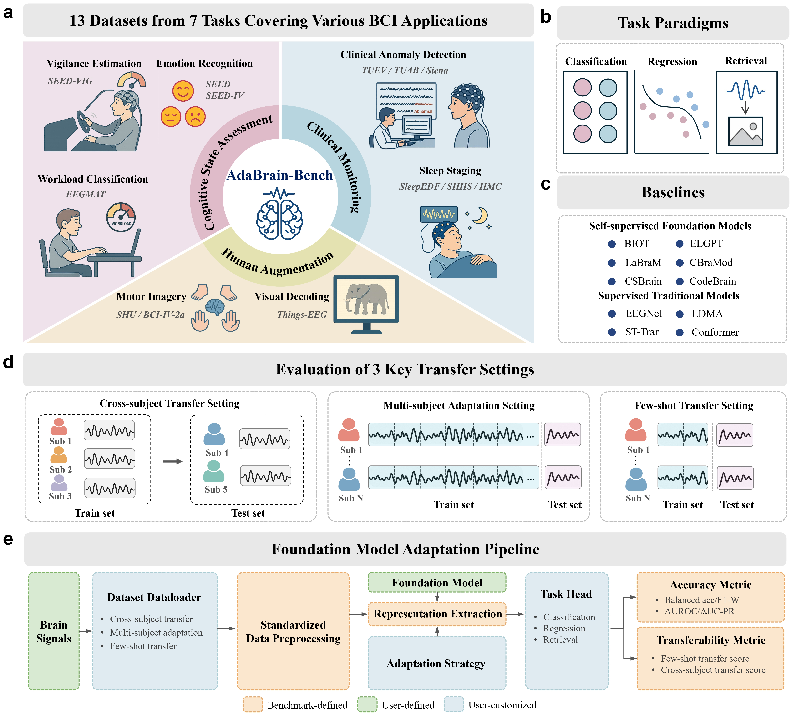
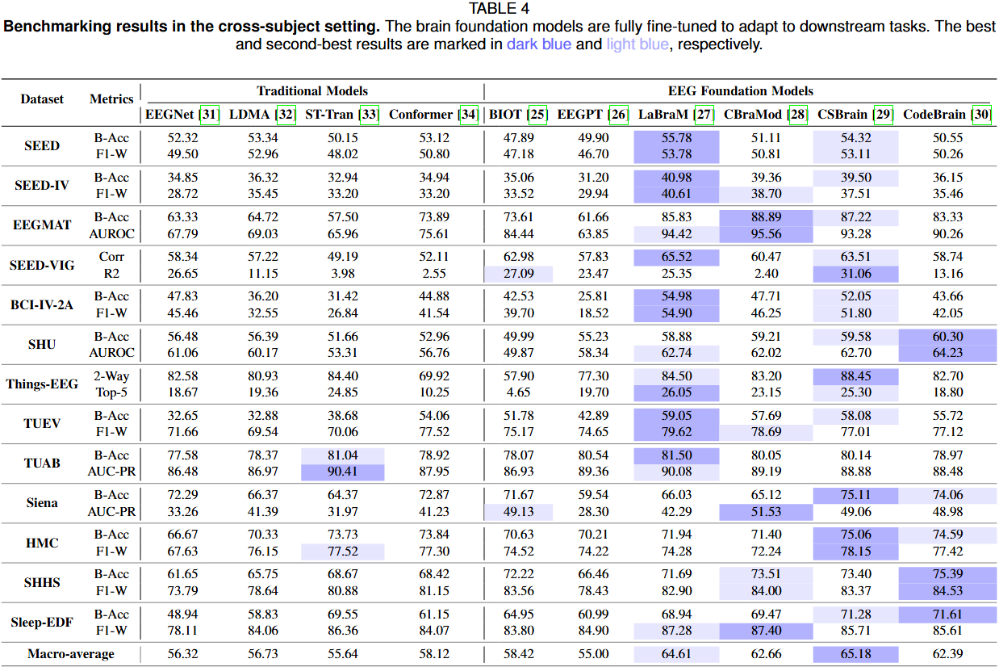
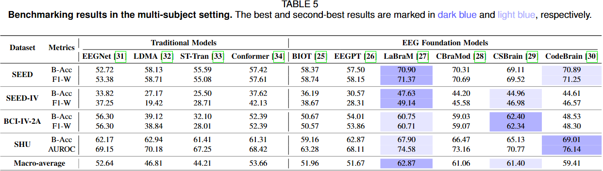
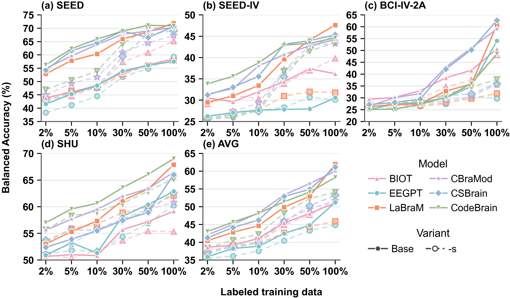

<div align="center">
  
# AdaBrain-Bench: Benchmarking Brain Foundation Models for Brain-Computer Interface Applications<br>

_Jiamin Wu, Zichen Ren, Junyu Wang, Pengyu Zhu, Yonghao Song, Mianxin Liu, Qihao Zheng, Chi Zhang, Bin Min, Lei Bai, Wanli Ouyang, Chunfeng Song_

<p>
    
</p>

[](https://arxiv.org/abs/2505.17099)


</div>
<br>


AdaBrain-Bench provides a comprehensive evaluation framework for EEG foundation models across *13 datasets and 7 tasks*, spanning three major BCI application domains: *cognitive state assessment, human augmentation, and clinical monitoring*. It covers diverse downstream paradigms, including *classification, regression, and retrieval*, and evaluates model generalization under *cross-subject, multi-subject, and few-shot settings* with comprehensive evaluation metrics.

The benchmark includes representative EEG-specific models and recent EEG foundation models, including [EEGNet](https://github.com/amrzhd/EEGNet), [LDMA](https://github.com/MiaoZhengQing/LMDA-Code), [ST-Tran](https://github.com/eeyhsong/EEG-Transformer), [Conformer](https://github.com/eeyhsong/EEG-Conformer), [BIOT](https://github.com/ycq091044/BIOT), [EEGPT](https://github.com/BINE022/EEGPT), [LaBraM](https://github.com/935963004/LaBraM), [CBraMod](https://github.com/wjq-learning/CBraMod), [CSBrain](https://github.com/yuchen2199/CSBrain), and [CodeBrain](https://github.com/jingyingma01/CodeBrain). Together, these models cover a broad spectrum of architectural designs and pre-training strategies, enabling systematic comparison of their transferability and downstream generalization across diverse BCI scenarios.


## Contents
- [Leaderboard](#leaderboard-in-progress)
- [Installation](#installation)
- [Dataset preparation](#dataset-preparation)
- [Models](#models)
- [Runing](#running)


## Leaderboard (in progress)
### Cross-Subject Transfer

<p>
    
</p>

### Multi-Subject Adaptation (Table 3)

<p>
    
</p>

### Few-Shot Transfer

<p>
    
</p>

For additional results and analyses, including the impact of pre-training, number of training subjects, normalization effects, and other key findings, please refer to our full paper.

## Installation
Install required packages:
```bash
conda create -n AdaBrain-Bench python=3.10
conda activate AdaBrain-Bench
pip install -r requirements.txt
```


## Dataset Preparation

Please refer to [DATASETS.md](DATASETS.md) for dataset download and preprocessing. Before running the fine-tuning code, you need to create json files to record the dataset information for different task paradigms in `/dataset_config` folder, which is formatted as follows:
```Classification.json
{
  "BCI-IV-2A": {
    "root": {
      "multi": "./preprocessing/BCI-IV-2A/multi_subject_json",
      "cross": "./preprocessing/BCI-IV-2A/cross_subject_json",
      "fewshot": "./preprocessing/BCI-IV-2A/multi_subject_json"
    },
    "num_classes": 4,
    "num_t": 4
  },
  "SEED": {
    "root": {
      "multi": "./preprocessing/SEED/multi_subject_json",
      "cross": "./preprocessing/SEED/cross_subject_json",
      "fewshot": "./preprocessing/SEED/multi_subject_json"
    },
    "num_classes": 3,
    "num_t": 1
  }
}
```
Here, "root" represents the folder containing the JSON files of the dataset. "multi", "cross", and "fewshot" stands for various settings. "num_classes" indicates the number of classes for the task. "num_t" represents the duration of the dataset signals in seconds.

## Models

We provide the links of the pre-trained weights for the following models. You can download them using the links below and place them in the `/checkpoints` folder.

| Model Name | Weight & Link |
|------------|-------------------------------|
| EEGPT      | [eegpt_mcae_58chs_4s_large4E.ckpt](https://github.com/BINE022/EEGPT) |
| LaBraM     | [labram-base.pth](https://github.com/935963004/LaBraM/tree/main/checkpoints) |
| CBraMod    | [pretrained_weights.pth](https://huggingface.co/weighting666/CBraMod) |
| BIOT       | [EEG-six-datasets-18-channels.ckpt](https://github.com/ycq091044/BIOT/tree/main/pretrained-models) |

---

To integrate a new model, see [ADD_MODEL.md](ADD_MODEL.md) for step-by-step instructions.

## Running
### Run Classification
After preparing the JSON file, you only need to execute a single command in the command line, to run the Classification task.

Take LaBraM and EEGPT on BCI-IV-2A as examples.
```bash
python run_finetuning.py  --model_name LaBraM  --dataset BCI-IV-2A --task_mod Classification --subject_mod cross --finetune_mod full --norm_method z_score --batch_size 64 --epochs 50 --lr 1e-3  --sampling_rate 200 --seed 0
```

```bash
python run_finetuning.py --model_name EEGPT --dataset BCI-IV-2A --task_mod Classification --subject_mod cross --finetune_mod full --norm_method z_score --batch_size 64 --epochs 50 --lr 1e-3  --sampling_rate 250 --seed 0
```
### Run Regression
To run the Regression task, you only need to execute a single command in the command line. 

Take LaBraM and EEGPT on SEED-VIG as examples.
```bash
python run_finetuning.py --model_name LaBraM --dataset SEED-VIG --task_mod Regression --subject_mod cross --finetune_mod linear --norm_method z_score --batch_size 64 --epochs 50 --lr 1e-3 --sampling_rate 200 --seed 0
```
```bash
python run_finetuning.py --model_name EEGPT --dataset SEED-VIG --task_mod Regression --subject_mod cross --finetune_mod linear --norm_method z_score --batch_size 64 --epochs 50 --lr 1e-3 --sampling_rate 250 --seed 0
```

### Run Retrieval
To run the Retrieval task, you only need to execute a single command in the command line. 

Take LaBraM and EEGPT on Things-EEG as examples.
```bash
python run_finetuning.py --model_name CodeBrain --dataset Things-EEG --task_mod Retrieval --subject_mod cross --finetune_mod full --norm_method z_score --batch_size 512 --epochs 40 --lr 5e-4 --subject_id 1 --sampling_rate 200 --seed 42 --weight_decay 0.05 --num_workers 16 --logger
```
```bash
python run_finetuning.py --task_mod Retrieval --model_name EEGPT --finetune_mod full --dataset Things-EEG --norm_method z_score --epochs 40 --batch_size 512 --lr 5e-4 --subject_mod single --subject_id 8 --seed 0
```
